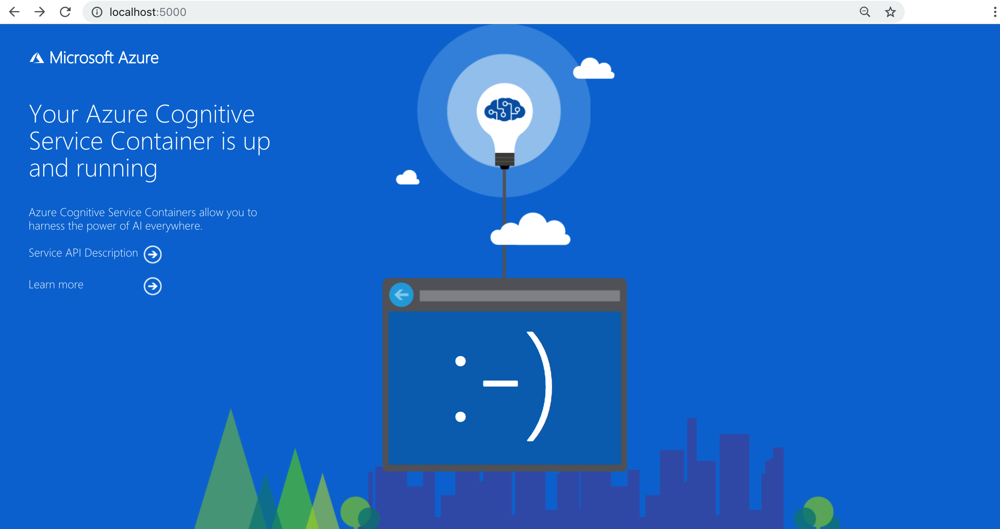

# 10 minute Quickstart: Running Cognitive Services on Azure Container Instances (ACI)

With the following steps, you can run Cognitive Services containers onto Azure Container Instances (ACI)


## Create a Cognitive Services resource for Text Analytics 

1. Sign into the [Azure portal](https://portal.azure.com).
1. Select **+ Create a resource**.
1. Go to the **Text Analytics** [Create window](https://ms.portal.azure.com/#create/Microsoft.CognitiveServicesTextAnalytics). 

    You can also navigate to **AI + Machine Learning** -> **Cognitive Services** -> **Text Analytics**. 

1. Enter the following details in the Create window:

    |Setting|Value|
    |--|--|
    |Name|`textanalytics-resource`|
    |Subscription|Select your subscription.|
    |Location|`(Europe) North Europe`|
    |Pricing Tier|`F0` - this is the free pricing tier.|
    |Resource Group|Select the available resource group.|
    |||

1. Select **Create**.

1. Select the bell icon in the top navigation. This is the notification window. It will display a blue **Go to resource** button when the resource is created. Select the button to go the new Text Analytics resource.
1. Collect the following information to use later:

    |Page in Azure portal Resource|Setting|Value|
    |--|--|--|
    | **Overview**|Endpoint|Copy the endpoint. It looks like `https://<region>.api.cognitive.microsoft.com/text/analytics/v2.0`|
    |**Keys**|API Key|Copy 1 of the two keys. It is a 32 alphanum-character string with no spaces or dashes, `xxxxxxxxxxxxxxxxxxxxxxxxxxxxxxxx`.|

## Launch Text Analytics Containers on Azure Container Instances (ACI) 

1. Select **+ Create a resource**.
1. Go to the **Container Instances** [Create window](https://ms.portal.azure.com/#create/microsoft.containerinstances). 

    You can also navigate to **Containers** -> **Container Instances**. 

1. On the **Basics** tab, enter the following details:

    |Page|Setting|Value|
    |--|--|--|
    |Basics|Subscription|Select your subscription.|
    |Basics|Resource group|Select the available resource group.|
    |Basics|Container name|`sentimentcontainer` - this name should be in lower caps|
    |Basics|Location|`(Europe) North Europe`|
    |Basics|Image type|`Public`|
    |Basics|Image name|Enter the sentiment container:<br>mcr.microsoft.com/azure-cognitive-services/sentiment|
    |Basics|OS type|`Linux`|
    |Basics|Size|Change size to:<br>2 cores<br>4 BG 
    ||||
   
    The other two Text Analytics containers could be entered but the [swagger exercise](#use-the-container-instance) further in this quickstart will have a slightly different experience: 

    * `mcr.microsoft.com/azure-cognitive-services/keyphrase`
    * `mcr.microsoft.com/azure-cognitive-services/language`
 
1. On the **Networking** tab, enter the following details:

    |Page|Setting|Value|
    |--|--|--|
    |Networking|Ports|Edit the existing port for TCP from `80` to `5000`. This means you are exposing the container on port 5000.|
    ||||

1. On the **Advanced** tab, enter the following details to pass through the container [required billing settings](https://docs.microsoft.com/azure/cognitive-services/text-analytics/how-tos/text-analytics-how-to-install-containers#billing-arguments) to the ACI resource:

    |Advanced page key|Advanced page value|
    |--|--|
    |`ApiKey`|Copied from the **Keys** page of the Text Analytics resource. It is a 32 alphanum-character string with no spaces or dashes, `xxxxxxxxxxxxxxxxxxxxxxxxxxxxxxxx`.|
    |`Billing`|Copied from the **Overview** page of the Text Analytics resource. Example: `https:///northeurope.api.cognitive.microsoft.com/text/analytics/v2.0`|
    |`Eula`|`accept`|
    
1. Select **Review and Create**. 
1. After validation passes, select **Create** to finish the creation process.
1. Select the bell icon in the top navigation. This is the notification window. It will display a blue **Go to resource** button when the resource is created. Select that button to go the new Text Analytics resource. 

## Use the Container Instance

1. Select the **Overview** and copy the IP address. It will be a numeric IP address such as `52.155.55.55`.
1. Open a new browser tab and use the IP address, for example, `https://<IP-address>:5000`. You will see the container's home page, letting you know the container is running.

     

1. Select **Service API Description** to view the swagger page for the container.

1. Select any of the **POST** APIs and select **Try it out**.  The parameters are displayed including the input:

    ```json
    {
      "documents": [
        {
          "language": "en",
          "id": "1",
          "text": "Hello world. This is some input text that I love."
        },
        {
          "language": "fr",
          "id": "2",
          "text": "Bonjour tout le monde"
        },
        {
          "language": "es",
          "id": "3",
          "text": "La carretera estaba atascada. Había mucho tráfico el día de ayer."
        }
      ]
    }
    ```

1. Update the first text value of the input JSON to the following text to learn the sentiment:
    `I have been to KubeCon conference in Barcelona and believe me, it is one of the best conference I have ever had. Great people, great session and thoroughly enjoyed. The best is expo which I witnessed some cool demos from Microsoft about Azure Container Instances (ACI), it is brilliant. If I were given an opportunity I will go again to this conference.`

1. Set **showStats** to true. 

1. Select **Execute** to determine the sentiment of the text. 
    
    The model packaged in the container generates a score: 1 is positive, 0 is negative. 

    The JSON response returned includes sentiment for the updated text:

    ```JSON
    {
      "documents": [
        {
          "id": "1",
          "score": 0.9721651077270508,
          "statistics": {
            "charactersCount": 353,
            "transactionsCount": 1
          }
        },
        {
          "id": "2",
          "score": 0.8401265144348145,
          "statistics": {
            "charactersCount": 21,
            "transactionsCount": 1
          }
        },
        {
          "id": "3",
          "score": 0.334433376789093,
          "statistics": {
            "charactersCount": 65,
            "transactionsCount": 1
          }
        }
      ],
      "errors": [],
      "statistics": {
        "documentsCount": 3,
        "validDocumentsCount": 3,
        "erroneousDocumentsCount": 0,
        "transactionsCount": 3
      }
    }
    ```

    You have successfully launched Cognitive Services containers in Azure Container Instance and generated a score to learn the sentiment of the text you provided. Have fun!
